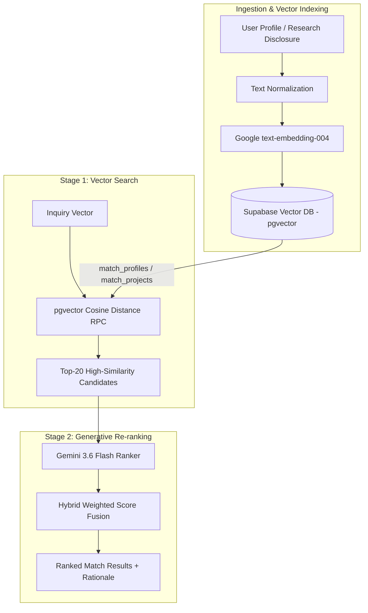

# Retrieval-Augmented Generation (RAG) System Architecture
## University of Ghana Virtual Industry Hub (UG-VIH)

---

## 1. Executive Summary & Architecture Overview

The **University of Ghana Virtual Industry Hub (UG-VIH)** implements a **Hybrid 2-Stage Retrieval-Augmented Generation (RAG)** pipeline connecting research disclosures, institutional partners, and investors.

Instead of relying solely on keyword searches or ungrounded LLM completions, UG-VIH pairs:
1. **Stage 1 (Dense Vector Retrieval)**: Powered by Google Gemini `text-embedding-004` (768 dimensions) and PostgreSQL `pgvector` similarity functions (`match_profiles` and `match_projects`).
2. **Stage 2 (Generative Synthesis & Re-ranking)**: Powered by `gemini-3.6-flash`, evaluating top candidate matches for qualitative synergy, skills overlap, and strategic alignment.

### Architectural Visual Diagram

<svg viewBox="0 0 900 480" width="100%" height="auto" xmlns="http://www.w3.org/2000/svg" style="background: #0f172a; border-radius: 16px; padding: 20px; font-family: system-ui, sans-serif;">
  <defs>
    <linearGradient id="gradTeal" x1="0%" y1="0%" x2="100%" y2="100%">
      <stop offset="0%" stop-color="#0d9488" />
      <stop offset="100%" stop-color="#14b8a6" />
    </linearGradient>
    <linearGradient id="gradNavy" x1="0%" y1="0%" x2="100%" y2="100%">
      <stop offset="0%" stop-color="#1e293b" />
      <stop offset="100%" stop-color="#334155" />
    </linearGradient>
    <linearGradient id="gradGold" x1="0%" y1="0%" x2="100%" y2="100%">
      <stop offset="0%" stop-color="#d97706" />
      <stop offset="100%" stop-color="#f59e0b" />
    </linearGradient>
    <linearGradient id="gradPurple" x1="0%" y1="0%" x2="100%" y2="100%">
      <stop offset="0%" stop-color="#6d28d9" />
      <stop offset="100%" stop-color="#8b5cf6" />
    </linearGradient>
    <filter id="shadow" x="-10%" y="-10%" width="120%" height="120%">
      <feDropShadow dx="0" dy="4" stdDeviation="6" flood-color="#000000" flood-opacity="0.4"/>
    </filter>
  </defs>

  <!-- Title -->
  <text x="450" y="38" text-anchor="middle" fill="#f8fafc" font-size="20" font-weight="800" letter-spacing="1">UG-VIH HYBRID RAG ARCHITECTURE</text>
  <text x="450" y="58" text-anchor="middle" fill="#94a3b8" font-size="12" font-weight="600">2-Stage Retrieval &amp; Synthesis Pipeline</text>

  <!-- Flow Lines -->
  <path d="M 180 180 L 250 180" stroke="#0d9488" stroke-width="3" stroke-dasharray="6 4"/>
  <path d="M 430 180 L 490 180" stroke="#0d9488" stroke-width="3"/>
  <path d="M 670 180 L 730 180" stroke="#8b5cf6" stroke-width="3"/>
  
  <path d="M 340 230 L 340 310" stroke="#38bdf8" stroke-width="2" stroke-dasharray="4 4"/>
  <path d="M 580 230 L 580 310" stroke="#f59e0b" stroke-width="2" stroke-dasharray="4 4"/>

  <!-- Stage 1 Box: Input & Vectorization -->
  <g filter="url(#shadow)">
    <rect x="30" y="120" width="150" height="110" rx="12" fill="url(#gradNavy)" stroke="#334155" stroke-width="2"/>
    <text x="105" y="150" text-anchor="middle" fill="#38bdf8" font-size="12" font-weight="700">USER INQUIRY</text>
    <text x="105" y="172" text-anchor="middle" fill="#e2e8f0" font-size="11">Profile / Proposal</text>
    <text x="105" y="192" text-anchor="middle" fill="#94a3b8" font-size="10">Research Query</text>
  </g>

  <!-- Vectorization Node -->
  <g filter="url(#shadow)">
    <rect x="250" y="120" width="180" height="110" rx="12" fill="url(#gradTeal)" stroke="#5eead4" stroke-width="2"/>
    <text x="340" y="150" text-anchor="middle" fill="#ffffff" font-size="13" font-weight="800">1. VECTOR EMBEDDING</text>
    <text x="340" y="172" text-anchor="middle" fill="#f0fdfa" font-size="11">text-embedding-004</text>
    <rect x="275" y="185" width="130" height="24" rx="6" fill="#0f766e"/>
    <text x="340" y="201" text-anchor="middle" fill="#ccfbf1" font-size="11" font-weight="700">768-D Vector Space</text>
  </g>

  <!-- PgVector Database -->
  <g filter="url(#shadow)">
    <rect x="490" y="120" width="180" height="110" rx="12" fill="url(#gradNavy)" stroke="#0284c7" stroke-width="2"/>
    <text x="580" y="150" text-anchor="middle" fill="#38bdf8" font-size="13" font-weight="800">2. VECTOR RETRIEVAL</text>
    <text x="580" y="172" text-anchor="middle" fill="#e2e8f0" font-size="11">PostgreSQL pgvector</text>
    <text x="580" y="192" text-anchor="middle" fill="#a5f3fc" font-size="10" font-weight="600">match_projects / profiles</text>
    <text x="580" y="212" text-anchor="middle" fill="#94a3b8" font-size="10">Cosine Distance &lt; 0.3</text>
  </g>

  <!-- Stage 2: Gemini Re-ranker -->
  <g filter="url(#shadow)">
    <rect x="730" y="120" width="140" height="110" rx="12" fill="url(#gradPurple)" stroke="#c084fc" stroke-width="2"/>
    <text x="800" y="150" text-anchor="middle" fill="#ffffff" font-size="12" font-weight="800">3. RE-RANKER</text>
    <text x="800" y="172" text-anchor="middle" fill="#f3e8ff" font-size="11">Gemini 3.6 Flash</text>
    <text x="800" y="192" text-anchor="middle" fill="#e9d5ff" font-size="10">Synergy &amp; Rationale</text>
  </g>

  <!-- Bottom Detailed Subsystems -->
  <g filter="url(#shadow)">
    <rect x="230" y="310" width="220" height="110" rx="12" fill="url(#gradNavy)" stroke="#475569" stroke-width="1.5"/>
    <text x="340" y="338" text-anchor="middle" fill="#f59e0b" font-size="12" font-weight="700">DOCUMENT PARSER</text>
    <text x="340" y="360" text-anchor="middle" fill="#cbd5e1" font-size="10">DOCX / PDF Text Extraction</text>
    <text x="340" y="380" text-anchor="middle" fill="#cbd5e1" font-size="10">Automatic Structural JSON</text>
    <text x="340" y="400" text-anchor="middle" fill="#64748b" font-size="9">documentExtractionService.ts</text>
  </g>

  <g filter="url(#shadow)">
    <rect x="470" y="310" width="220" height="110" rx="12" fill="url(#gradGold)" stroke="#fde68a" stroke-width="1.5"/>
    <text x="580" y="338" text-anchor="middle" fill="#78350f" font-size="12" font-weight="800">HYBRID SCORE FUSION</text>
    <text x="580" y="360" text-anchor="middle" fill="#451a03" font-size="11" font-weight="700">S = α · S_LLM + (1 - α) · S_Vec</text>
    <text x="580" y="380" text-anchor="middle" fill="#78350f" font-size="10">Weighted Qualitative &amp; Distance</text>
    <text x="580" y="400" text-anchor="middle" fill="#92400e" font-size="9">matchingService.ts</text>
  </g>

</svg>

---

## 2. End-to-End Workflow Diagram



---

## 3. Mathematical Foundations & Formulations

### 3.1 Vector Embedding Mapping
An input document or user profile $T$ is mapped into a 768-dimensional space $\mathbb{R}^{768}$:

$$\vec{v} = f_{\text{embed}}(T) \in \mathbb{R}^{768}$$

### 3.2 Dimension Normalization & Zero-Vector Safety
Vector dimensions are strictly enforced to 768 dimensions with zero-vector baseline protection:

$$\vec{v}_{\text{norm}} = \begin{cases} \text{slice}(\vec{v}, 0, 768) & \text{if } |\vec{v}| > 768 \\ \vec{v} \parallel [0.001]^{768 - |\vec{v}|} & \text{if } |\vec{v}| < 768 \end{cases}$$

If $\forall i, |v_i| < 10^{-9}$:

$$\vec{v}_{\text{baseline}} = [0.001, 0.001, \dots, 0.001]^{T} \in \mathbb{R}^{768}$$

### 3.3 Cosine Similarity & Vector Distance
Given query vector $\vec{u}$ and candidate vector $\vec{v}$:

$$\text{Sim}(\vec{u}, \vec{v}) = \cos(\theta) = \frac{\vec{u} \cdot \vec{v}}{\|\vec{u}\|_2 \|\vec{v}\|_2} = \frac{\sum_{i=1}^{768} u_i v_i}{\sqrt{\sum_{i=1}^{768} u_i^2} \sqrt{\sum_{i=1}^{768} v_i^2}}$$

In PostgreSQL `pgvector`, cosine distance is computed as:

$$d_{\text{cosine}}(\vec{u}, \vec{v}) = 1 - \text{Sim}(\vec{u}, \vec{v})$$

The Stage 1 retrieval objective minimizes cosine distance:

$$\arg\min_{\vec{v} \in \mathcal{D}} d_{\text{cosine}}(\vec{u}, \vec{v})$$

### 3.4 Hybrid Scoring Fusion Formula
The final compatibility score $S_{\text{final}} \in [0, 100]$ fuses Stage 1 dense vector similarity with Stage 2 LLM qualitative score ($S_{\text{LLM}}$):

$$S_{\text{final}} = \alpha \cdot S_{\text{LLM}} + (1 - \alpha) \cdot \left(100 \times \text{Sim}(\vec{u}, \vec{v})\right)$$

Where $\alpha = 0.65$ balances qualitative AI reasoning with mathematical vector closeness.

---

## 4. Key Code Implementations

### 4.1 Embedding Generation (`services/embeddingService.ts`)

```typescript
import { GoogleGenAI } from "@google/genai";

export const EmbeddingService = {
  getEmbedding: async (text: string): Promise<number[]> => {
    const ai = new GoogleGenAI({ apiKey: process.env.GEMINI_API_KEY });
    const response = await ai.models.embedContent({
      model: 'text-embedding-004',
      contents: text,
    });
    const values = (response as any).embedding?.values || [];
    return EmbeddingService.ensureDimension(values, 768);
  }
};
```

---

### 4.2 Vector DB Retrieval RPC (`services/storageService.ts`)

```typescript
// Stage 1: Vector Search RPC Call
getMatches: async (userId: string, embedding: number[]) => {
  const queryVec = EmbeddingService.ensureDimension(embedding, 768);

  const { data: projects } = await supabase.rpc('match_projects', {
    query_embedding: queryVec,
    match_threshold: 0.0,
    match_count: 20
  });

  return filterByVisibility(projects, userId);
}
```

---

### 4.3 Generative Re-Ranking Engine (`services/matchingService.ts`)

```typescript
// Stage 2: Gemini 3.6 Flash Re-ranker
rankMatches: async (userProfile: AIProfile, candidates: any[]) => {
  const ai = new GoogleGenAI({ apiKey: process.env.GEMINI_API_KEY });
  const response = await ai.models.generateContent({
    model: 'gemini-3.6-flash',
    contents: `Rank candidates for user profile: ${JSON.stringify(userProfile)}: ${JSON.stringify(candidates.slice(0, 15))}`,
    config: { responseMimeType: "application/json" }
  });
  return JSON.parse(response.text);
}
```

---

## 5. Security & System Guarantees

1. **Row-Level Security Filtering**: Dynamic access control hides unapproved research disclosures before Stage 2 LLM prompt injection.
2. **In-Memory Caching**: Cache keys hash user profiles and candidate sets to prevent duplicate re-ranking API latency.
3. **Graceful Fallbacks**: If vector RPC queries return empty sets, fallback keyword indexing ensures continuous app operation.
